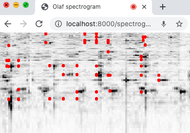

# OLAF - Overly Lightweight Acoustic Fingerprinting

! [](https://joss.theoj.org/papers/f5b4572fd51939c2ab8363e561bdb2b7)

Olaf is a C application or library for content-based audio search. Olaf is able to extract fingerprints from an audio stream, and either store those fingerprints in a database, or find a match between extracted fingerprints and stored fingerprints. Olaf does this efficiently in order to be used on **embedded platforms**, traditional computers or in web browsers via WASM.

Please be aware of the patents US7627477 B2 and US6990453 and perhaps others. They describe techniques used in algorithms implemented within Olaf. These patents limit the use of Olaf under various conditions and for several regions. Please make sure to consult your intellectual property rights specialist if you are in doubt about these restrictions. If these restrictions apply, please **respect the patent holders rights**. The main aim of Olaf is to serve as a learning platform on efficient (embedded) acoustic fingerprinting algorithms.

## Overview

1. [Why Olaf?](#why-olaf)
2. [Olaf on traditional computers](#olaf-on-traditional-computers)
   - [Compilation](#compilation)
   - [Compilation with Zig](#compilation-with-zig)
   - [Olaf on Docker](#olaf-on-docker)
3. [Olaf in the browser](#olaf-in-the-browser)
4. [Embedded Olaf](#embedded-olaf)
5. [Olaf Usage](#olaf-usage)
   - [Store fingerprints](#store-fingerprints)
   - [Query fingerprints](#query-fingerprints)
   - [Delete fingerprints](#delete-fingerprints)
   - [Deduplicate a collection](#deduplicate-a-collection)
   - [Database stats](#database-stats)
   - [Cache fingerprints and store cached fingerprints](#cache-fingerprints-and-store-cached-fingerprints)
6. [Configuring Olaf](#configuring-olaf)
7. [Testing, evaluating and benchmarking Olaf](#testing-evaluating-and-benchmarking-olaf)
   - [Testing Olaf](#testing-olaf)
   - [Evaluating Olaf](#evaluating-olaf)
   - [Benchmarking Olaf](#benchmarking-olaf)
8. [Contribute to Olaf](#contribute-to-olaf)
9. [Olaf documentation](#olaf-documentation)
10. [Limitations of Olaf](#limitations-of-olaf)
11. [Further Reading](#further-reading)
12. [Credits](#credits)

## Why Olaf?

With respect to other audio search systems, Olaf stands out for three reasons:

* Olaf runs on embedded devices.
* Olaf is fast on traditional computers.
* Olaf runs in the browsers.

There seem to be no lightweight acoustic fingerprinting libraries that are straightforward to run on embedded platforms. On embedded platforms memory and computational resources are severely limited. Olaf is written in portable C with these restrictions in mind. Olaf mainly targets 32-bit ARM devices such as some Teensy's, some Arduino's and the ESP32. Other modern **embedded platforms** with similar specifications and should work as well.

Olaf, being written in portable C, also targets **traditional computers**. There, the efficiency of Olaf makes it run fast. On embedded devices reference fingerprints are stored in memory. On traditional computers fingerprints are stored in a high-performance key-value-store: LMDB. LMDB offers a B+-tree based persistent storage ideal for small keys and values with low storage overhead.

Olaf works in **the browser**. Via Emscripten Olaf can be compiled to [WASM](https://en.wikipedia.org/wiki/WebAssembly). This makes it relatively straightforward to combine the capabilities of the [Web Audio API](https://developer.mozilla.org/en-US/docs/Web/API/Web_Audio_API) and Olaf to create browser based audio fingerprinting applications.


*Olaf running in a browser*

Olaf was featured on [hackaday](https://hackaday.com/2020/08/30/olaf-lets-an-esp32-listen-to-the-music/). There is also a small discussion about Olaf on [Hacker News](https://news.ycombinator.com/item?id=24292817).

## Olaf on traditional computers

To use Olaf `ffmpeg` (and `ffprobe`, which `--fragmented` uses to read durations) need to be installed on your system. While the core of Olaf is in pure c, a Zig wrapper provides an easy to use interface to its capabilities. The Zig wrapper converts audio (with `ffmpeg`), parses command line arguments and reports results in a readable format.

To install ffmpeg on a Debian like system: `apt-get install ffmpeg`. On macOS `ffmpeg` can be installed with [homebrew](https://brew.sh/) by calling `brew install ffmpeg`.


### Compilation

To compile Olaf for traditional computers, [Zig](https://ziglang.org/) is used: the default `make` target simply calls `zig build`. Make sure Zig and `ffmpeg` are installed. Compilation and installation:

```bash
#sudo apt-get install ffmpeg

git clone https://github.com/JorenSix/Olaf
cd Olaf
make
sudo make install
```

By default, a directory named `.olaf` is created in the current user home directory. The command line binary is installed to `/usr/local/bin/olaf`, which is assumed to be on the user's path.

The Makefile additionally contains `gcc` based targets (C11 standard) for special purposes: `make compile_core` builds the standalone C core binary `bin/olaf_core`, `make lib` builds the shared library used by the python wrapper, `make mem` builds the in-memory version `bin/olaf_mem` used to generate embedded fingerprint headers and `make web` builds the emscripten WebAssembly version. Note that `zig build` compiles the C core with stricter flags (`-Wextra -Werror=return-type -fPIC`) than the gcc targets (`-W -Wall -pedantic`).

### Compilation with Zig

Zig can also be invoked directly. Zig is a programming language which also ships with a c compiler. In this project Zig is employed as an easy to use cross-compiler.

A `build.zig` file is provided. Just call "zig build" to compile for your platform. On an M1 mac it gives the following:

```bash
zig build
file zig-out/bin/olaf # Mach-O 64-bit executable arm64
```

The power of Zig is, however, more obvious when an other target is provided. For a list of platforms, please consult the output of `zig targets`. To build a windows executable run the following commands.

```bash
zig build -Dtarget=x86_64-windows-gnu -Doptimize=ReleaseSmall
file zig-out/bin/olaf.exe # PE32+ executable (console) x86-64, for MS Windows
```

Zig also supports WebAssembly as a target platform as an alternative to Emscripten. The `build.zig` file includes a conditional to build the memory db for WASM. To get a WASM binary call the following:

```bash
zig build -Dtarget=wasm32-wasi-musl -Doptimize=ReleaseSmall
file zig-out/bin/olaf_core.wasm #WebAssembly (wasm) binary module version 0x1 (MVP)
```


Olaf has been designed with a UNIX like environment in mind but also works on Windows thanks to the Zig cross compilation. It is less tested on Windows.

### Olaf on Docker

Olaf can be containerized with [Docker](https://www.docker.com/). The provided Dockerfile is based on [Alpine linux](https://www.alpinelinux.org/) and installs only the needed requirements. A way to build the container and run Olaf:

```bash
mkdir -p $HOME/.olaf/docker_dbs
docker build -t olaf:1.0 .
wget "https://filesamples.com/samples/audio/mp3/sample3.mp3"
docker run -v $HOME/.olaf/docker_dbs:/root/.olaf -v $PWD:/root/audio olaf:1.0 olaf store sample3.mp3
docker run -v $HOME/.olaf/docker_dbs:/root/.olaf -v $PWD:/root/audio olaf:1.0 olaf stats
```

In this case the `$HOME/.olaf/docker_dbs` is mapped to `/root/.olaf` in the container to store the database. The audio enters the system via a mapping of `$PWD` to `/root/audio` in the container, which is also the work directory in the container. So relative paths with respect to `$PWD` of the host can be resolved in the container, absolute paths can not.

If you prefer docker compose the following should get you started:

```bash
wget "https://filesamples.com/samples/audio/mp3/sample3.mp3"
docker compose run --rm olaf olaf store sample3.mp3
docker compose run --rm olaf olaf query sample3.mp3
docker compose run --rm olaf olaf stats
```

## Olaf in the browser

To compile Olaf to WASM the `emcc` compiler from Emcripten is used. Make sure [Emscripten is correctly installed](https://emscripten.org/docs/getting_started/downloads.html) and run the following:

```bash
make web

python3 -m http.server --directory wasm #start a web browser
open "http://localhost:8000/spectrogram.html" #open the url in standard browser
```

Note that the web version does not use a key value store but a list of hashes stored in a header-file. See below for more info.

## Embedded Olaf

Olaf has been tested on the ESP32 microcontroller. Other, similar microcontrollers might work as well. The embedded version does not use a key value store but a list of hashes stored in a `.h` header file. This header file is the fingerprint index.

The 'index' or header file can be created on a computer to contain fingerprints extracted from audio. To create this header file do the following:

```bash
make mem
olaf to_raw your_audio_file.mp3
bin/olaf_mem store olaf_audio_your_audio_file.raw "arandomidentifier" > your_header_file.h
```

To test and debug this header file, use the `mem` version of Olaf on your computer. The ESP32 version is basically the same as the `mem` version, only the audio comes from microphone input and not from a file.

For debugging there are also two conversion commands: `olaf to_raw [--threads n] audio_files...` converts audio to RAW format (`f32le`, mono, at `target_sample_rate`, 16 kHz by default) in the current directory, and `olaf to_wav [--threads n] audio_files...` converts audio to a single channel wav file next to the input. An existing output is kept (and reported as `SKIPPED`) unless `-f` is given.


## Olaf Usage

On traditional computers, Olaf provides a *command line interface* it can be called using `olaf sub-application [argument...]`. For each task Olaf has to perform, there is a sub-application. There are sub-applications to store fingerprints, to query audio fragments,... . A typical interaction with Olaf could look like this:



In a more copy-paste friendly way the following demonstrates example use of Olaf. In the example, Olaf is built and the test dataset is downloaded (by `zig build test`), then all audio files in a folder are indexed and a query is matched against them. Finally statistics about the index are printed.

```bash
git clone https://github.com/JorenSix/Olaf
cd Olaf
make && sudo make install
zig build test

#store all audio in a folder and execute a query
olaf store dataset/ref
olaf query dataset/queries/1051039_34s-54s.mp3

#print statistics of the index:
olaf stats
```

Running `olaf` without arguments opens an interactive terminal browser: pick an audio file and press `s` to store it, `m` to match (query) it or `f` for a fragmented query, and `q` to quit; the database statistics are shown next to it. On Linux and macOS, messages from ffmpeg and the core go to `~/.olaf/olaf_tui.log` instead of the screen.

### Store fingerprints

The store command extracts fingerprints from an audio file and stores them in a reference database. The incoming audio is decoded and resampled using `ffmpeg`. `ffmpeg` needs to be installed on your system and available on the path.

```bash
olaf store [-f] [--threads n] [--format <human|csv|json>] audio_item...
olaf store --with-ids audio_item identifier [audio_item identifier ...]
```

Audio items that are already in the index are skipped, so re-running `olaf store` on a folder only indexes new files. This is governed by `skip_duplicates` in the configuration (default `true`).

**-f, --force** stores audio items again even when they are already indexed.

**--threads n** uses multiple threads to extract fingerprints in parallel.

**--format \<human|csv|json>** sets the per-file summary format printed on stderr (default: `human`).

**--with-ids** lets you provide your own identifier for each audio item instead of relying on the automatically generated hash. Items are given as `audio_item identifier` pairs.

The `audio_item` can be:

1. An audio file: `olaf store audio.mp3`, if the audio file contains multiple channels they are mixed to a mono.
2. A video file. The **first audio stream** is extracted from the video container and used as input: `olaf store video.mkv`
3. A folder name: Olaf attempts to **recursively** find all audio files within the folder. It does this with a limited allowlist of known audio file name extensions. `olaf store /home/user/Music`
4. A text file: The text file should contain a list of file names. The following commands recursively finds all mp3 within the current directory and subsequently stores them in the reference database.

```bash
find . -name "*.mp3" > list.txt
olaf store list.txt
```

Internally each audio stream is given an identifier using a one time [Jenkins Hash](https://en.wikipedia.org/wiki/Jenkins_hash_function) function of its canonical absolute path (symlinks resolved), so the same file gets the same identifier however it is referenced. This identifier is returned when a match is found. A list connecting these identifiers to file names is also stored automatically.

### Query fingerprints

The query command extracts fingerprints and matches them with the database:

```bash
olaf query [--threads n] [--fragmented] [--no-identity-match] [--format <csv|json>] query.opus
```

The query command has several options.

**--threads n** tells Olaf to use multiple threads to query the index. This can significantly speed up matching if multiple cores are available on your system.

**--fragmented** this chops the query into fragments of `fragment_duration_in_seconds` (default 30 seconds) and matches each fragment with the reference database separately. The first fragment is matched and matches are reported, then it goes on with the next fragment and so forth. Each result reports the fragment start as `query_offset`. This is practical if an unsegmented audio file needs to be matched with the reference database.

**--no-identity-match** If the query is present in the index it obviously matches itself. This option prevents identity matches to be reported. This is useful for deduplication.

**--format \<csv|json>** sets the output format (default: `csv`).

To query audio coming from the microphone there is the `olaf microphone` command. It spawns `ffmpeg` to capture the default microphone, streams the audio into the matcher, and prints CSV matches live as they are found.

```bash
olaf microphone
```

The input is captured with `ffmpeg` and configured via the `microphone_input_format` and `microphone_device` settings (see [Configuring Olaf](#configuring-olaf)). The defaults follow the platform: `avfoundation` / `:default` on macOS and `alsa` / `default` on Linux. Any `ffmpeg` input works, see [the `ffmpeg` input devices docs](http://www.ffmpeg.org/ffmpeg-devices.html#Input-Devices); to list the macOS devices:

```bash
ffmpeg -f avfoundation -list_devices true -i ""
```

Results are printed every `print_result_every` seconds (3 by default for live input). Live capture only supports CSV output, and the command is not available on Windows. `olaf query` itself always needs audio files; it does not read standard input.

### Delete fingerprints

Deletion of fingerprints is similar to adding prints:

```bash
olaf delete item.mp3
olaf delete --with-ids item.mp3 identifier
```

Use **--with-ids** to delete by explicit identifier (the same identifier used during `olaf store --with-ids`), given as `audio_item identifier` pairs.

Note that it is currently unclear what the performance implications are when adding and removing many items to the db. In other words: how balanced the B+ tree remains with many leaves removed. To make sure the tree remains balanced it is always an option to clear the database and re-index the audio:

```bash
olaf clear
```

The clear command deletes the database and optionally clears the folder with cached fingerprints. It requests permission before deleting. To force deletion the `-f` flag can be used: `olaf clear -f`.

### Deduplicate a collection

This command finds duplicate audio content in a folder. First each audio file is stored in the reference database. Next each file is used as a query and matched with the reference database. The file should, evidently, match itself but self-matches are ignored, leaving only duplicates.

A duplicate means that audio from the original is found in another file. The start and stop times of the found fragment are reported. If the match reports a start of nearly zero and a duration similar to the duration of the original audio file then a 'full duplicate' is found: it is almost certainly the same exact track. If only a couple of seconds are reported it means that only a couple of seconds of the original audio are found in the duplicate.

```bash
olaf dedup [-f] [--threads n] [--fragmented] [--skip-store] [--format <human|csv|json>] field_recordings/archive
```

**--threads n** tells Olaf to use multiple threads, for both the store and the query step. This can significantly speed up indexing if multiple cores are available on your system.

**--format** sets the format of the store records (on stderr, as with `store`) and of the query results (`csv` for `human`, or `json`). **-f** stores files again that are already indexed.

**--fragmented** this tells Olaf to chop each query into fragments of `fragment_duration_in_seconds` (default 30 seconds) during matching. The first fragment is matched with the reference database and matches are reported, then it goes on with the next fragment and so forth. This is practical for partial matches with the reference database.

**--skip-store** skips the store step. Use this when the index already contains the folder, so dedup only runs the query phase.


### Cache fingerprints and store cached fingerprints

Caching prints can be practical to speed up indexing. Olaf is single threaded mainly for use on embedded platforms. Additionally, the data storage of Olaf only allows one write thread (multiple readers are allowed). However, on more powerful computing machinery it might be of interest to use multiple cores to extract fingerprints. This can speed up indexing significantly.

The way around this is to cache fingerprints to a file with all available cores - or multiple machines - and later store all prints in the index.

```bash
olaf cache [--threads n] *.mp3
olaf store_cached
```

Also a default is the storage place for cached items: `~/.olaf/cache`. The configuration can be found at the top.


### Database stats

To get statistics on the database use `stats`. It prints information on the b-tree structure backing the storage.

```bash
olaf stats
```


## Configuring Olaf

Olaf reads its configuration at runtime from a JSON file: `~/.olaf/olaf_config.json`, or else `olaf_config.json` next to the `olaf` executable. Without either file the built-in defaults are used. `cli/olaf_config.example.json` is an annotated starting point and `cli/olaf_config.schema.json` describes every setting, its type, default and bounds (editors can use it for completion and validation). An unknown key is reported as a warning, a value of the wrong type or out of range is an error.

The configuration includes the location of the database and cache folders, the accepted audio file extensions, the amount of fingerprints extracted, matching parameters, ... Changing the fingerprint extraction settings (for example `target_sample_rate`) makes an existing index incompatible with new queries: re-index after such a change.

To print the configuration in use, and which file it came from, use `olaf config`.

The `microphone` command uses two more settings: `microphone_input_format` (the `ffmpeg` input format) and `microphone_device` (the device passed to `ffmpeg -i`). Their defaults depend on the platform: `avfoundation` / `:default` on macOS and `alsa` / `default` on Linux.

## Testing, Evaluating and Benchmarking Olaf

The tests check **whether Olaf works**. The evaluation verifies **how well** Olaf works. The benchmark checks **how fast** Olaf works and how it deals with scalability.

[More details on testing, evaluating and benchmarking Olaf](./eval) can be found in the separate page. There information on memory use can be found together with a comparison against Panako.

### Testing Olaf

The first thing this checks is whether Olaf compiles correctly. Afterwards, a small dataset is indexed and some queries are fired. The result of the queries is evaluated for correctness. Also the memory version of Olaf is checked. To run this yourself, with `ffmpeg` and `ffprobe` installed:

```bash
git clone https://github.com/JorenSix/Olaf
cd Olaf
make && sudo make install
zig build test
```

Less interesting are the unit tests, these are mainly of interest for developing Olaf. The unit test can be compiled with `make test` and ran with `./bin/olaf_tests`.

### Evaluating Olaf

In the `eval` folder there is a recognition benchmark which takes a folder as input, indexes a fraction of it and evaluates queries, optionally with several modifications. [SoX](https://sox.sourceforge.net/) needs to be available on the system for the distortions to work.

```bash
python3 eval/olaf_recognition_benchmark.py /folder/with/music
```

### Benchmarking Olaf

With the script a folder of audio files is stored and it is registered how long it takes to store 64, 128, 256, 512,... files. If run with the [FMA full](https://github.com/mdeff/fma) dataset a total of more than 200 days of audio are stored at a rate of just under 2000 times real-time with a 96 CPU-core system. An interpretation of the graph is that indexing remains linear on larger datasets. At every doubling of the database the [query performance](./eval/olaf_benchmark/olaf_benchmark_query.svg) is also checked. Run the benchmark yourself:

```bash
python3 eval/olaf_benchmark/olaf_benchmark.py /folder/with/music
```


## Contribute to Olaf

There are several ways to contribute to Olaf. The first is to use Olaf and report issues or feature requests using the Github Issue tracker. Bug reports are greatly appreciated, but keep in mind the note below on responsiveness.

Another way to contribute is to dive into the code, fork and improve Olaf yourself. Merge requests with additional documentation, bug fixes or new features will be handled and end up in the main branch if correctness, maintainability and simplicity are kept in check. However, keep in mind the note below:

My time to spend on Olaf is limited and goes in activity bursts. If an issue is raised it might take a couple of months before I am able to spend time on it during the next burst of activity. A period of relative silence does not mean your feedback / pull request is not greatly valued!

## Olaf documentation

The [documentation of Olaf](https://jorensix.github.io/Olaf) is generated with [doxygen](http://doxygen.nl) and can be consulted on github via the gh-pages branch.

## Limitations of Olaf

* ~~Currently a complete audio file is read in memory in order to process it. While the algorithm allows streaming, the current implementation does not allow to store incoming streams.~~ Now you can choose whether to compile in the single or stream reader: choose either `olaf_reader_single.c` or `olaf_reader_stream.c`, which is a bit slower.
* Only one write process: LMDB limits the number of processes that can write to the key-value store to a single process. Attempting to write to the key-value store while an other write-process is busy should put the process automatically in a wait state untile the write lock is released (by the other process). Reading can be done frome multiple processes at the same time.
* Audio decoding is done externally. The core of Olaf does fingerprinting. ffmpeg or similar audio decoding software is required to decode and resample various audio formats.
* ~~Removing items from the reference database is currently not supported. The underlying database does support deletion of items so it should be relatively easy to add this functionality.~~
* Performance implications when removing many items from the database are currently unclear. In other words: how balanced does the B+tree remain when removing many leaves.
* ~~Olaf is single threaded. The main reasons are simplicity and limitations of embedded platforms. The single threaded design keeps the code simple. On embedded platforms with single core CPU's multithreading makes no sense. On traditional computers there might be a performance gain by implementing multi-threading. However, the time spent on decoding audio and storing fingerprints is much larger than analysis/extraction so the gain might be limited. As an work-around multiple processes can be used simultaniously to query the database.~~
* The limitation of the number of tracks that can be indexed and queried on a single computer is not known. Olaf has been used to index and query the [fma_full dataset](https://github.com/mdeff/fma). This dataset contains 100 000 tracks totaling more than 340 days of audio. The dataset, around 800GB of mp3s, were indexed in a 15GB database and query speed remained at a respectable 80 times realtime: it only takes a single second to query 80 seconds of audio. With the datastructure having logaritmic complexity the limit of the number of songs per pc might be a couple of times higher.

## Further Reading

Some relevant reading material about (landmark based) acoustic fingerprinting. The order gives an idea of relevance to the Olaf project.

1. Wang, Avery L. **An Industrial-Strength Audio Search Algorithm** (2003)
2. Six, Joren and Leman, Marc **[Panako - A Scalable Acoustic Fingerprinting System Handling Time-Scale and Pitch Modification](http://www.terasoft.com.tw/conf/ismir2014/proceedings/T048_122_Paper.pdf)** (2014)
3. Cano, Pedro and Batlle, Eloi and Kalker, Ton and Haitsma, Jaap **A Review of Audio Fingerprinting** (2005)
4. Arzt, Andreas and Bock, Sebastian and Widmer, Gerhard **Fast Identification of Piece and Score Position via Symbolic Fingerprinting** (2012)
5. Fenet, Sebastien and Richard, Gael and Grenier, Yves **A Scalable Audio Fingerprint Method with Robustness to Pitch-Shifting** (2011)
6. Ellis, Dan and Whitman, Brian and Porter, Alastair **Echoprint - An Open Music Identification Service** (2011)
7. Sonnleitner, Reinhard and Widmer, Gerhard **Quad-based Audio Fingerprinting Robust To Time And Frequency Scaling** (2014)
8. Sonnleitner, Reinhard and Widmer, Gerhard **[Robust Quad-Based Audio Fingerprinting](http://dx.doi.org/10.1109/TASLP.2015.2509248)** (2015)

The programming style of Olaf attempts to use an OOP inspired way to organize code and divide responsibilities and interfaces. For more information see on this style consult this document about [OOP in C](https://www.state-machine.com/doc/AN_OOP_in_C.pdf). Also of interest is the [Modern C book by Jens Gustedt](https://modernc.gforge.inria.fr/).

## Credits

* [PFFFT](https://bitbucket.org/jpommier/pffft/src/default/) a pretty fast FFT library. BSD license
* [LMDB](https://symas.com/lmdb/) [Lightning Memory-Mapped Database](https://en.wikipedia.org/wiki/Lightning_Memory-Mapped_Database), a fast key value store with a permissive software license (the OpenLDAP Public License) by Howard Chu.
* [Hash table](https://github.com/fragglet/c-algorithms) and dequeue by Simon Howard, ISC lisence
* [libsamplerate-js](https://github.com/aolsenjazz/libsamplerate-js) the browser based version of Olaf uses a WASM build of an audio resampling library [SRC](http://www.mega-nerd.com/SRC/) which is BSD licensed. `libsamplerate-js` is MIT licensed.

Olaf by Joren Six at IPEM, Ghent University.