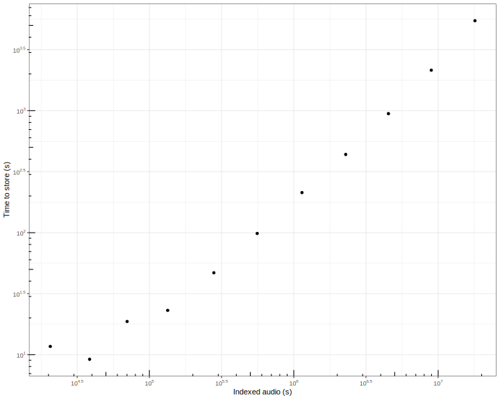
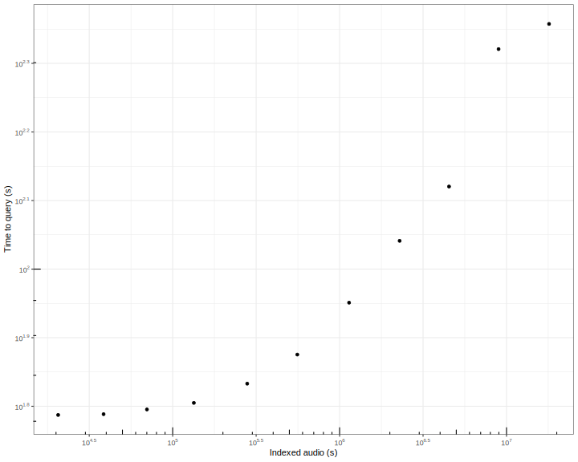
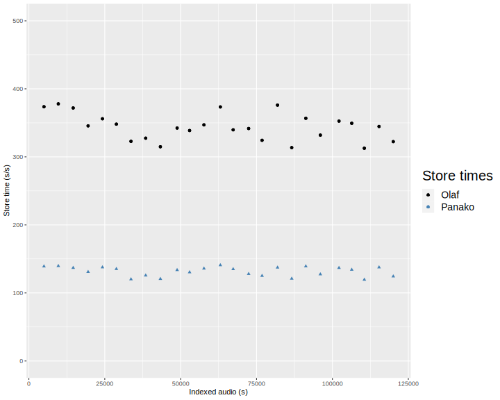
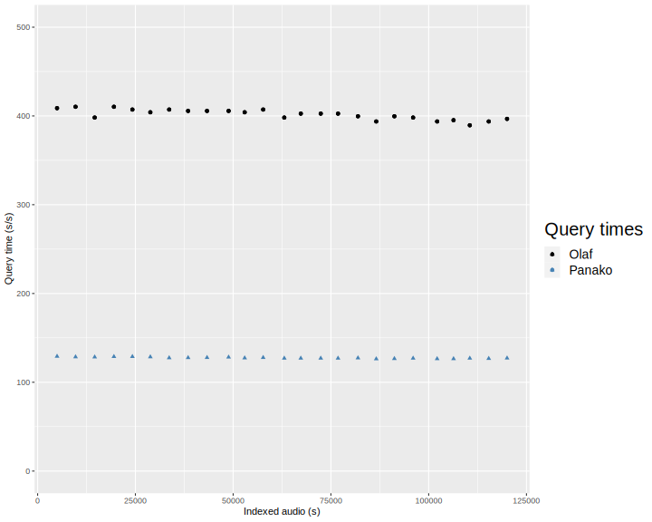
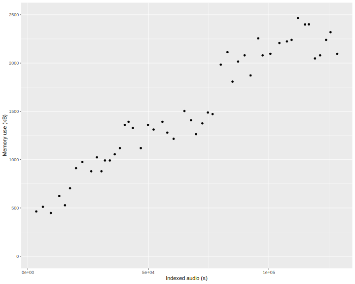

# Olaf - Evaluation & Benchmarking

The tests check **whether Olaf works**. The evaluation verifies **how well** Olaf works. The benchmark checks **how fast** Olaf works and how it deals with scalability and resources. There are a few evaluation and benchmarking scripts available for Olaf. This text describes each script.

## Benchmark index size - **how fast** does Olaf run?

The benchmark script stores a large amount of audio in an index and keeps the time it takes to store the audio. Each time the size of the index is doubled a number of queries run to check the time it takes to query the index.

With the script a folder of audio files is stored and it is registered how long it takes to store 64, 128, 256, 512,... files. If run with the [FMA full](https://github.com/mdeff/fma) dataset a total of more than 200 days of audio are stored at a rate of just under 2000 times real-time with a 96 CPU-core system. An interpretation of the graph is that indexing remains linear on larger datasets. At every doubling of the database the [query performance](./eval/olaf_benchmark/olaf_benchmark_query.svg) is also checked. Run the benchmark yourself:

The absolute values might differ significantly from one machine to another and are not that relevant. The fact that store speed and query speed do not halve each time the index size doubles is relevant: this shows that the system is scalable. This relatively limited effect of index size is expected to be similar on all machines.

<div align="center">

<br>
<small><strong>Fig.</strong> This reports the time it takes to store 200 days of audio (or reference 10^7 is about 100 days of audio) The log-log linear relation means that the speed of storing audio is not slower for larger database.</small>
</div>

<div align="center">

<br>
<small><strong>Fig.</strong> This reports the time it takes to query audio. Each time the same audio is queried. This shows that a query goes slower when the index is larger but, crucially, the slowdown is not proportional to the increase in index size: this indicates a level of scalability.</small>
</div>

## Benchmark - **how fast** does Olaf run vs Panako?

Olaf shares many similarities with [Panako](https://github.com/JorenSix/Panako). A similar algorithm is implemented. There are a few key differences. Panako is implemented in Java, is multi-threaded and is not conservative with memory use. Panako also contains an additional algorithm which is robust against speed changes.

There is a script which compares Olaf run times with Panako directly by storing items in an empty database and now and then run a query. The times it takes to store and run queries is reported and compared. Run the script with a (large) collection of music (e.g. the free music archive):

```bash
ruby eval/olaf_vs_panako.rb /home/user/music
```

Note that the script has a couple of assumptions and limitations:

* the script does not check the result of the commands
* the indexes of both systems should be empty at the start, this is not checked by the script
* it assumes both Panako and Olaf are installed correctly on the system

<div align="center">

<br>
<small><strong>Fig.</strong> The time it takes to store the same audio files in Panako and Olaf. Times are reported in s/s. A value of 250 means that the system can store 250 seconds of audio in a single second. Note that the storage speed of Olaf is about double that of Panako. This is mainly due to an algorithmic optimization in Olaf in the max filtering step.</small>
</div>

<div align="center">

<br>
<small><strong>Fig.</strong> The time it takes to query the same audio files in Panako and Olaf. The time is reported in s/s. A value of 250 means that it takes e.g. 1 second to query for 250s of audio. The difference is mainly due to an algorithmic optimization in Olaf in the max filtering step.</small>
</div>

## Benchmark - How much memory does Olaf use?

A script is provided to measure memory use when running a 20 second query. To see the influence of the size of the index the memory use is measured after every 10 stored files. The size of the index is expressed in seconds. The memory use is reported in kilobytes.

The script needs access to a folder with `mp3` or other audio files. It can be ran like this:

```bash
ruby eval/olaf_memory_use.rb /User/Music
```

The script assumes that the installed version of Olaf uses the same index as `bin/olaf_c` which is used for memory consumption.

To measure memory use, the macOS utility `/usr/bin/time` is employed. Similar utilities are available for Linux or other systems. To use the script on your system check and adapt the `memory_use` function accordingly.

The baseline memory of an 'empty' c program is subtracted from the reported values: only the memory use of Olaf is reported not that of the environment. On macOS this means that about one megabyte of memory is not reported! The following one-liner can be used to check the memory use to run an empty c program on macOS:

```bash
echo "int main(int argc, char** argv) { return 0; }" > t.c && gcc t.c && /usr/bin/time -l  ./a.out
```

<div align="center">

<br>
<small><strong>Fig.</strong> Memory use of running a 20 second query with Olaf for several sizes of the index. On traditional computers a memory use of a few MB is negligible. This changes for embedded systems. The memory use of Olaf in that case is lower than 512kB since the index is smaller, the queries are shorter and no key-value store is used.</small>
</div>

Memory use is one thing, memory leaks another. To detect memory leaks the macOS `leaks` utility can be used in the following way:

```bash
leaks --atExit -- bin/olaf_c query dataset/raw/queries/olaf_audio_147199_115s-135s.raw 147199.mp3
```

This reports if any memory leaks are found and where these potentially originate. To detect leaks in all code paths other commands (store, delete) should be checked as well. On other systems similar utilities exist: on Linux [valgrind](https://valgrind.org/) is a possible alternative.

## Testing Olaf - check **whether Olaf works**

The first thing this checks is whether Olaf compiles correctly. Afterwards, a small dataset is indexed and some queries are fired. The result of the queries is evaluated for correctness. Also the memory version of Olaf is checked. To run this yourself, with Ruby, `ffmpeg` and `ffprobe` installed:

```bash
git clone https://github.com/JorenSix/Olaf
cd Olaf
make && make install
ruby eval/olaf_functional_tests.rb
```

Less interesting are the unit tests, these are mainly of interest for developing Olaf. The unit test can be compiled with `make test` and ran with `./bin/olaf_tests`.

### Evaluating Olaf

In the `eval` folder there is an evaluation script which takes a folder as input and stores and evaluates queries with several modifications. [SoX](https://sox.sourceforge.net/) needs to be available on the system for this to work.

[True/false negative/positives](https://en.wikipedia.org/wiki/Sensitivity_and_specificity) are reported. There are a few options to make the evaluation more thorough or fit your use case. The number of tracks stored, the number of distractors, the number of true negatives, the severity of the modifications, the duration of the queries, ... can be configured by modifying the first lines of the script. To run the evaluation:

```bash
ruby eval/olaf_evaluation.rb /folder/with/music
```

The result of an evaluation depends on the input audio but should be similar to the following for music like signals:

```
True positive rate for none_0 1.000
True negative rate for none_0 0.970
True positive rate for flanger_0 0.859
True negative rate for flanger_0 0.960
True positive rate for band_passed_2000Hz 1.000
True negative rate for band_passed_2000Hz 0.970
True positive rate for chorus_0 0.860
True negative rate for chorus_0 0.949
True positive rate for echo_0 0.970
True negative rate for echo_0 0.970	
```