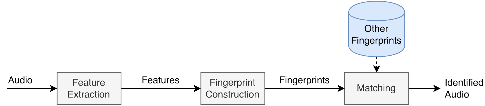

# Summary

Olaf stands for __Overly Lightweight Acoustic Fingerprinting__ and solves the problem of finding short audio fragments in large digital audio archives. The content-based audio search algorithm implemented in Olaf can identify a short audio query in a large database of thousands of hours of audio using an acoustic fingerprinting technique.

The dataflow in Olaf closely resembles the flow depicted in \autoref{fig:general}. Audio is transformed to features which are grouped in recognizable fingerprints. The fingerprints are compared with a database of reference fingerprints. If a match is found, it is reported or, in case of a true negative, the system reports that the audio is not present in the database. The properties of the acoustic fingerprinting system mainly depend on the selection of features, the information captured by the fingerprints and the performance of the matching step.

{width=90%}

The fingerprints of Olaf are based on peaks in a spectral representation of audio, an audio feature which has been proven to be a good candidate for audio matching [@Wang2003a;@six2020olaf;@wang2003patent;@six2022panako;@six2014panako]. Olaf combines either two or three spectral peaks into a fingerprint. Two-peak fingerprints allow matching shorter queries and improves matching noisy queries. The limited information in two peaks becomes a problem if the reference dataset becomes larger and false positive matches -- fingerprint hash collisions -- become more common. Three-peak fingerprints contain more bits of information which makes false positives much less common. Matches become more reliable but shorter, or more distorted queries, might be missed. Three-peak fingerprints work well for longer or 'cleaner' queries in combination with larger reference datasets. 

# Statement of need

Audio search algorithms have been described for decades [@Wang2003a;@sonnleitner2014quad_based_fingerprinter;@haitsma2002fingerprinter;@herre2002scalable;@fenet2011pitch_shift_fingerprinting;@cano2005fingerprinting_overview] but have not been accessible for researchers due to the lack of proper, scalable, freely available implementations. Olaf solves this problem by providing an acoustic fingerprinting system which can be used by researchers for digital music archive management, audio-to-audio alignment on embedded devices or other uses. 

@six2018dupapps and @six2023duplicates describe the applications of acoustic fingerprints for digital music archive management. These range from meta-data quality verification - through the identification of duplicates - to merging archives with potential duplicate material. A less straightforward application of Olaf is audio-to-audio alignment and synchronization [@six2015synchronizing;@six2017framework]. In that case the matching fingerprints are used to align e.g. multiple video recordings of the same event by aligning the audio attached to each video.

On a more meta-level Olaf also facilitates MIR and acoustic fingerprinting research. Audio duplicate detection can be used to clean up and evaluate machine learning datasets [@weck2023data]. Olaf can also serve as a baseline for specific acoustic fingerprinting cases such as broadcast audio monitoring [@cortes2022baf].

The portability and low memory[^1] usage of Olaf allows it to run on microcontrollers such as the ESP32 or similarly specced microcontrollers. This unique feature facilitates innovative IoT music recognition and music synchronization applications. Olaf also runs in the browser. A compilation emits a WebAssembly binary which, together with the Web Audio API, enables browser based acoustic fingerprinting applications. 

Alternative systems with available implementations are by @neuralfp, Panako by @six2022panako, audfprint by @ellis2014labrosafp, PeakFP by @cortes2022baf and ChromaPrint by @chromaprint. All have a different focus and none offer the portability to target browsers or the low memory usage to target microcontrollers.

# Design

Simplicity and maintainability are two keywords in the design of Olaf. The code aims to be as readable and simple as possible. The code uses an object-oriented inspired approach to organize the ANSI C11 [@ISO1999] code. Opaque structs are used to store and encapsulate state information. Polymorphism is implemented by having a header file defining an interface which is then implemented in different ways in source files. The choice of implementation is done at __compile time__. For example, the database used by Olaf can be a key-value store or an in-memory database. To provide this functionality, the interface `olaf_db.h` has two implementations which provide either the key-value store or the in-memory database. The modularity of Olaf makes it relatively straightforward to stack Olaf's building blocks for use on embedded devices, browsers and traditional computers.  

C has a long history which should allow Olaf to stand the test of time. Arguably C is the most portable programming language and has been around for decades and will be available for decades to come. Boring technology enables longevity. C also provides a lot of exiting footguns, of which I made ample use. However, many bugs have been found by running Olaf on different platforms / contexts - Windows, browsers, embedded devices, musl - and, thanks to continuous integration. Each time Olaf is updated a battery of functional tests are executed automatically.

For traditional computers file handling and transcoding is governed by a companion Ruby script. This script expands lists of incoming audio files, transcodes audio files, checks incoming audio, checks for duplicate material validates arguments and input. The Ruby script, essentially, makes Olaf an easy-to-use CLI application and keeps the C parts of Olaf simple. The C core it is not concerned with e.g. transcoding. Crucially, the C core trusts input and does not do much input validation and does not provide many guardrails. Since the interface is the Ruby script, this seems warranted.

Olaf depends on two C libraries: a key-value store and an FFT library. LMDB [@lmdb] serves as a high performance key-value store. PFFFT[@pffft] is used to speed up FFT calculations. Additionally a hash table and a dequeue data structure are included from c-algorithms [@calgorithms]. Internal documentation follows the DoxyGen [@doxygen] standards. Two papers give the rationale behind the algorithms [@Wang2003a;@six2014panako]. Olaf can be compiled and installed using the `make` tool or with Zig [@zig] cross-compiler. The code and documentation of Olaf is hosted in a publicly available GitHub repository.

[^1]: The memory usage to run a 20s query on an index containing one hour of audio is less than 512kB. The embedded variant takes considerably less memory since it does not need the key-value store and has a smaller index. A script is provided to measure memory use.  

# Acknowledgements

Development of Olaf is partially funded by the Ghent University BOF Project PaPiOM.

# References